# A1 Poster Design Brief

Project: **AI-Based Learning Style Report: VAK Questionnaire System**  
Team: **Abraham Gomes Samosir, Tristan Bonardo Silalahi, Newten Putra Santoso**  
Institution: **Program Studi Teknik Informatika, Universitas Padjadjaran (UNPAD)**  
Repository QR target: **https://github.com/MFDOOMs/Tugas-UAS-AI-kelompok-API**

> Replace the study program text if the official program name is different. Use the official UNPAD logo asset from the university source.

---

## 1. Canvas and Layout

- Format: **A1 portrait**
- Physical size: **594 mm x 841 mm**
- Suggested digital frame: **7016 px x 9933 px at 300 DPI**
- Margin: **36-48 mm**
- Grid: **3-column poster layout**
- Gutter: **18-24 mm**
- Reading order: top to bottom, left to right
- Overall style: modern academic poster, clean, professional, high contrast, not decorative-heavy.

### Recommended Layout

1. **Header band**
   - Left: official UNPAD logo
   - Center: project title and subtitle
   - Bottom line: team names, study program, university
   - Right: small badge "Artificial Intelligence Course Project"

2. **Column 1**
   - Abstract
   - Introduction
   - Materials

3. **Column 2**
   - Methodology
   - Architecture Diagram
   - Algorithm Effectiveness Testing

4. **Column 3**
   - Result
   - Ethical Responsibility
   - Conclusion
   - Recommendation
   - Acknowledgment
   - QR Code to GitHub repository

5. **Footer band**
   - Repository URL
   - Contact/team information
   - UNPAD identity line

---

## 2. Visual Identity

### Color Palette

- Deep navy: `#0F2A43`
- Teal: `#0F8B8D`
- Soft green: `#2F9E44`
- Amber accent: `#C47F18`
- Paper background: `#F6F8FB`
- Text ink: `#17202A`
- Muted text: `#637083`
- Line color: `#D9E1EA`

### Typography

- Title: **Inter / Poppins / Helvetica**, bold, 72-90 pt
- Section headings: bold, 34-42 pt
- Body text: regular, 24-28 pt
- Captions and labels: 18-22 pt
- Keep line spacing generous for poster readability.

### Visual Treatment

- Use clean white panels with subtle borders.
- Use icons sparingly for Dataset, Model, API, Web, PDF.
- Use a clear flow diagram instead of abstract decoration.
- Use score/probability bars in the Result section.

---

## 3. Header Content

### Title

**AI-Based Learning Style Report: VAK Questionnaire System**

### Subtitle

Machine Learning-based questionnaire system for predicting student learning styles and providing downloadable learning profile reports.

### Author Line

Abraham Gomes Samosir, Tristan Bonardo Silalahi, Newten Putra Santoso  
Program Studi Teknik Informatika, Universitas Padjadjaran (UNPAD)

### Logo Requirement

Place the official **UNPAD logo** on the top-left header area. Keep clear space around the logo and do not distort its aspect ratio.

---

## 4. Poster Content

## Abstract

This project develops an AI-based learning style report system using a VAK questionnaire approach. The system collects student responses, converts them into Visual, Auditory, and Kinesthetic average scores, and predicts the dominant learning style using a trained Machine Learning model. A FastAPI backend serves the prediction endpoint, while a lightweight HTML, CSS, and JavaScript frontend provides the questionnaire interface, score visualization, model confidence, and downloadable profile PDF based on the predicted learning style. The final system is intended as an educational support tool, not as a permanent psychological label.

## Introduction

Students often differ in how they process learning materials. Some students respond better to visual and reading-based resources, others benefit from verbal explanation and discussion, while others learn more effectively through practice and hands-on activities. The VAK framework offers a simple way to categorize these tendencies into Visual, Auditory, and Kinesthetic learning preferences.

The objective of this project is to build a web-based system that can process questionnaire responses and provide a learning style prediction using a Machine Learning model. The system also provides an interpretable score breakdown, probability output, and a downloadable profile PDF to help students reflect on suitable learning strategies.

## Materials

- **Dataset:** VAK questionnaire dataset containing 15 learning preference questions and a target label `Learner`.
- **Questionnaire mapping:**
  - Q1-Q5: Visual / Reading tendency
  - Q6-Q10: Auditory tendency
  - Q11-Q15: Kinesthetic tendency
- **Frontend:** HTML, CSS, Vanilla JavaScript
- **Backend:** FastAPI
- **Modeling tools:** Python, pandas, scikit-learn, joblib
- **Model file:** `models/model_gaya_belajar.pkl`
- **Report outputs:** Visual Profile PDF, Auditory Profile PDF, Kinesthetic Profile PDF

## Methodology

1. **Data Preparation**
   - Load the VAK questionnaire dataset.
   - Rename question columns into Q1-Q15.
   - Remove duplicate rows and invalid labels.
   - Validate that all questionnaire scores are numeric and within the 1-5 range.

2. **Feature Engineering**
   - Calculate three average scores:
     - `visual`
     - `auditory`
     - `kinesthetic`
   - These three features are aligned with the web application payload sent to the `/predict` API endpoint.

3. **Model Training**
   - Compare candidate algorithms such as Logistic Regression and Random Forest.
   - Use stratified train-test split to preserve class distribution.
   - Use class balancing to reduce the impact of class imbalance.
   - Export the selected model into `model_gaya_belajar.pkl`.

4. **Web Integration**
   - The frontend collects answers from 15 questionnaire items.
   - JavaScript calculates average VAK scores.
   - The frontend sends JSON data to FastAPI:

```json
{
  "visual": 4.2,
  "auditory": 3.1,
  "kinesthetic": 2.4
}
```

5. **Report Delivery**
   - FastAPI loads the `.pkl` model and returns the predicted style.
   - The frontend displays the prediction, confidence, probability breakdown, and score visualization.
   - The system provides a downloadable profile PDF based on the predicted class.

---

## 5. Architecture Diagram

Use this diagram as the poster architecture reference. Recreate it in Figma using rounded rectangles, arrows, and short labels.

```mermaid
flowchart LR
    A["Student fills 15-item VAK questionnaire"] --> B["Frontend: HTML, CSS, JavaScript"]
    B --> C["Feature Engineering in Browser"]
    C --> D["JSON Payload: visual, auditory, kinesthetic"]
    D --> E["FastAPI Backend /predict"]
    E --> F["Load model_gaya_belajar.pkl"]
    F --> G["Machine Learning Prediction"]
    G --> H["Prediction Result + Probabilities"]
    H --> I["Frontend Result View"]
    I --> J["Download Matching Profile PDF"]
```



### Architecture Notes for Design

- Put frontend elements on the left.
- Put FastAPI and model in the center.
- Put prediction, result visualization, and PDF output on the right.
- Use a distinct color for the ML model block.
- Add small labels for data format: `JSON`, `.pkl`, and `PDF`.

---

## 6. Algorithm Effectiveness Testing

### Model Evaluation Summary

| Metric | Value |
|---|---:|
| Selected model | Random Forest |
| Input features | Visual, Auditory, Kinesthetic average scores |
| Test accuracy | **97.18%** |
| Cross-validation accuracy | **95.17%** |
| Output classes | Visual, Auditory, Kinesthetic |

### Discussion

The Random Forest model achieved strong predictive performance on the test set, with a test accuracy of 97.18% and cross-validation accuracy of 95.17%. This indicates that the three engineered features are highly informative for predicting the target class in the dataset. However, the result should still be interpreted carefully because high accuracy on a structured questionnaire dataset does not guarantee perfect generalization to all students or learning contexts.

### Suggested Result Visualization

Create a compact evaluation panel with:

- Accuracy bar: 97.18%
- Cross-validation bar: 95.17%
- Small confusion-matrix placeholder
- Text note: "Model evaluated using stratified train-test split and cross-validation."

---

## 7. Result

The web application successfully integrates the trained model into an interactive questionnaire system. After users answer the 15 questions, the system computes average scores for Visual, Auditory, and Kinesthetic dimensions, sends them to the backend API, and displays the prediction result dynamically.

The result page includes:

- Predicted learning style
- Model confidence
- Probability breakdown for each class
- VAK score visualization
- Interpretation of strengths and possible learning challenges
- Recommended learning activities
- Download button for the matching profile PDF

The final output is not only a classification label but also a structured learning profile that students can use as a reflective study guide.

---

## 8. Ethical Responsibility

This system must be presented as a learning support tool rather than a deterministic psychological assessment. A student's learning style should not be treated as a permanent identity or used to limit access to certain learning methods.

### Key Ethical Considerations

1. **Avoid fixed labeling**
   - The result should be framed as a learning preference prediction, not a permanent student category.
   - Students may benefit from multiple learning strategies depending on the topic and context.

2. **Transparency**
   - The system should explain that the prediction is based on questionnaire responses and Machine Learning classification.
   - Users should know that the model uses average Visual, Auditory, and Kinesthetic scores as input features.

3. **Dataset limitations**
   - The model is only as reliable as the dataset used for training.
   - If the dataset is imbalanced or limited in diversity, prediction quality may be affected.

4. **Bias awareness**
   - Demographic information should not be used as a prediction feature unless there is a justified, ethical, and privacy-safe reason.
   - The current implementation focuses only on questionnaire response patterns.

5. **User autonomy**
   - The system should recommend strategies without forcing students to follow only one learning mode.
   - Recommendations should encourage flexible and mixed learning methods.

6. **Privacy**
   - The system should avoid collecting sensitive personal data.
   - If deployed publicly, a privacy notice should explain what data is collected, stored, or processed.

### Ethical Statement for Poster

"The prediction result is intended to support student reflection and study planning. It should not be interpreted as a fixed psychological label or used to restrict learning opportunities."

---

## 9. Conclusion

The project demonstrates that a lightweight web application can integrate a VAK questionnaire, Machine Learning model, and downloadable learning profile reports into one functional system. The Random Forest model produced strong evaluation results using engineered Visual, Auditory, and Kinesthetic average scores. The final application provides a practical interface for collecting responses, generating predictions, explaining results, and giving profile-based study guidance.

## 10. Recommendation

Future development should include:

- Broader dataset validation with more diverse student groups.
- More detailed evaluation using precision, recall, F1-score, and confusion matrix visualization.
- User testing to evaluate whether the profile recommendations are understandable and helpful.
- Improved privacy handling if deployed online.
- A model monitoring process to detect performance drift when new data is added.
- Optional multilingual interface for English and Indonesian users.

## 11. Acknowledgment

The authors would like to thank Universitas Padjadjaran and the Artificial Intelligence course environment that supported the development of this project. This work was developed by Abraham Gomes Samosir, Tristan Bonardo Silalahi, and Newten Putra Santoso as part of an academic project exploring Machine Learning integration in educational technology.

---

## 12. QR Code Requirement

### QR Target

Use this URL for the QR code:

```text
https://github.com/MFDOOMs/Tugas-UAS-AI-kelompok-API
```

### QR Placement

- Place QR code in the bottom-right corner.
- Minimum printed QR size: **35 mm x 35 mm**
- Add label: **Scan to access the GitHub repository**
- Add the repository URL below the QR code in small text.
- Use high contrast: black QR on white background.

---

## 13. Final Figma Checklist

- [ ] A1 portrait frame, 594 mm x 841 mm
- [ ] Official UNPAD logo placed in the header
- [ ] Program study and university name included
- [ ] Team member names included
- [ ] Abstract section included
- [ ] Introduction section included
- [ ] Materials section included
- [ ] Methodology section included
- [ ] Clear architecture diagram included
- [ ] Algorithm effectiveness testing results included
- [ ] Result section included
- [ ] Ethical responsibility section included
- [ ] Conclusion section included
- [ ] Recommendation section included
- [ ] Acknowledgment section included
- [ ] QR code points to GitHub repository
- [ ] Text readable from a normal poster viewing distance
- [ ] No important content placed too close to the edge

